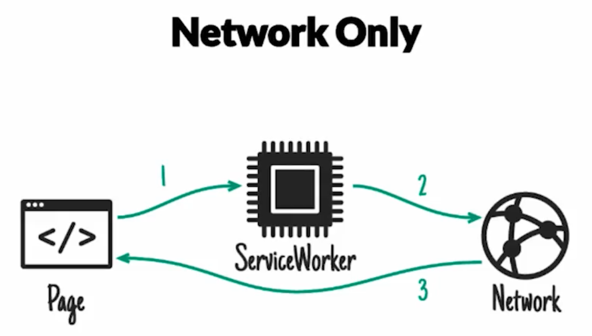
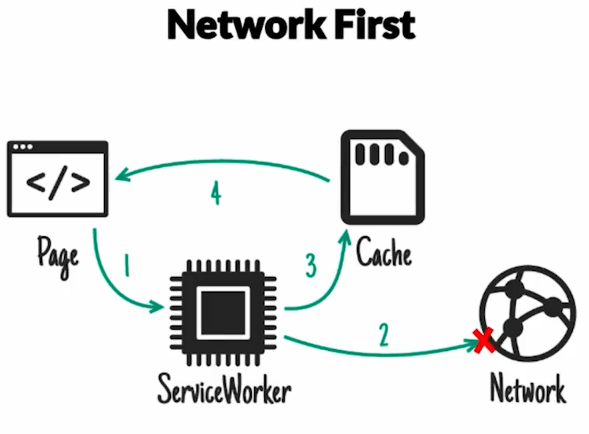
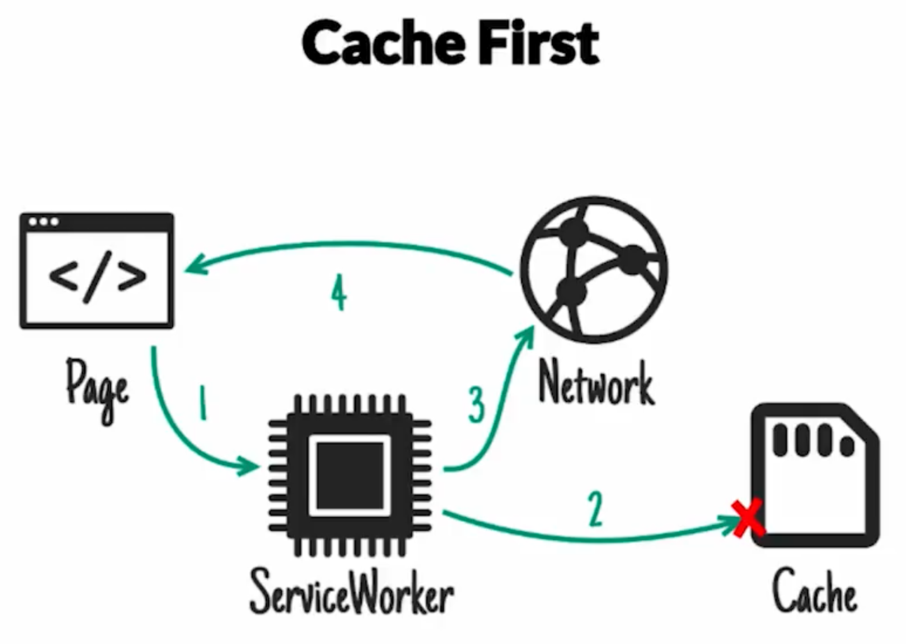
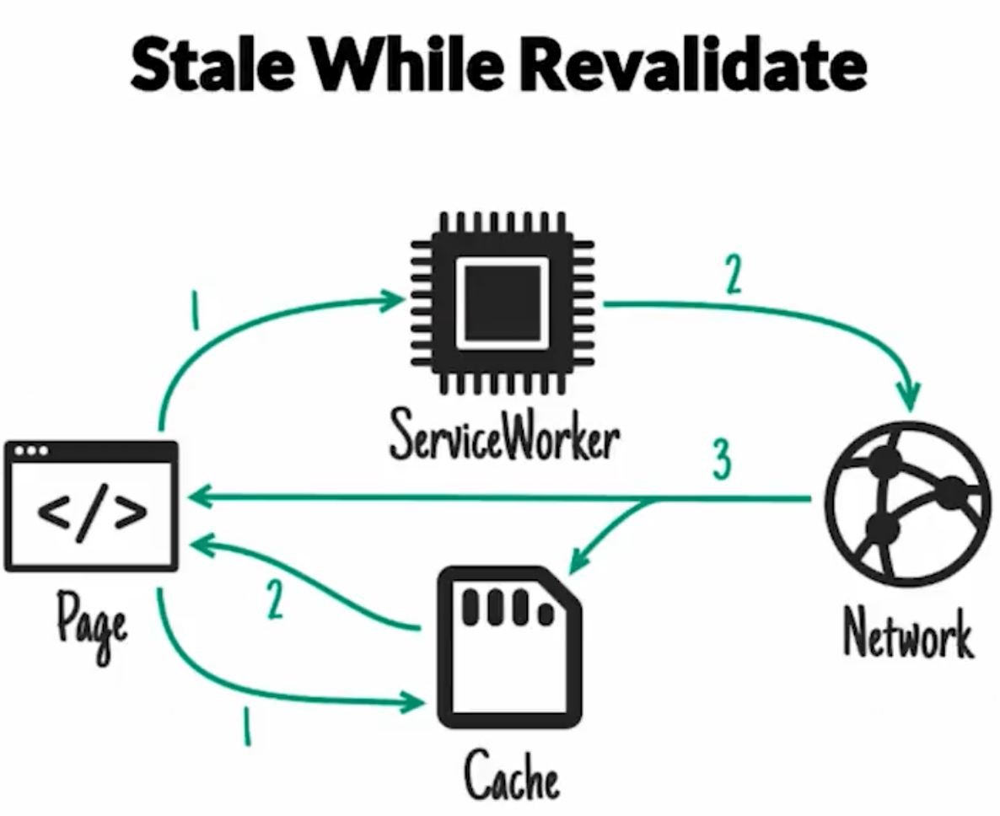

# PWA

* Web Apps optimizadas para Mobile.
* Es un estandar de calidad.
* Es como debe pensar primero nuestra web para mobil, primero en nuestros usuarios, en concexiones no tan buenas.
* Pueden funcionar en cualquiera de nuestros dispositivos.
* Gracias a los services workers pueden trabajar ofline, recibir notificaciones e instalarce en la home screen como se hace una aplicación nativa.
* Al indexar en buscadores y ser compartidas en redes es mucho mas fácil conseguir y convertir usuarios con una PWA que con una aplicación nativa.
* El motivo de usarlo es querer tener una aplicación web rápida.
* Restricciones en iOS
  * Solo tenemos 50 MB de espacio disponible, que se pueden borrar en cualquier momento.
  * Utiliza un browser levemente diferente que se debuguea solamente en safari con mac OS.
  * Al volver a la aplicación siempre se resetea la aplicación a la Home screen.
  * No tenemos notificaciones.
  * No funciona en Full Screen.

## App Nativa

* Ofrecen un mejor acceso de mejor calidad a todas las funciones del sistema operativo.
* Mayor libertad de crear aplicaciones avanzadas con un mejor nivel de performance que es difícil en lograrlo con la web.

## Herramientas

### Google Lighthouse

* Es una herramienta oficial de google que viene con chrome.
* Podemos hacer diagnostico de una web app. Se centra en performance, algunos detalles de flexibilidad y tiene una herramienta para testear si la aplicación se considera un PWA.
* Simula un teléfono Nexus 5 y una conexión de mala calidad 3G 400k de conexión y ralentiza el procesador de la computadora.

## Performance

### First Meaningful Paint (Primer pintado significativo)

* Que tiempo tardo en renderizar el navegador la aplicación que tenga algún tipo de sentido. Generalmente este debe ser entre 1 y 2 segundos.
* Concejos de como mejorar estos tiempos.
  * Server Side Rendering: El servidor carga y cachea, desde el servidor el request y renderiza el HTML listo para consumir.
  * Menos HTML y CSS: Tamaño del Payload (Código HTML y CSS)
  * Servers más rápidos: Agregar CDNs o servidores más rápidos.

### First Interactive y Consistently Interactive

* Esta medición indica en que momento esta interactiva la aplicación.

### Time to Interactive

* Reducir la cantidad de JS: Tiene que ver con el framework que estamos utilizado. Lo recomendable debe ser de menos de 5s en una conexión mala.
* Reducir el tiempo de respuesta.

### Web Manifest

* Activa la funcionalidad de Add to Home Screen. 
* Para probar en android se debe tener lo siguiente en cuenta:
  * Todo funcione con HTTPS, que tengamos una conexión encriptada.

## Service Worker

* Es lo que hace posible que las progresive apps funcionen.
* Solo funciona en modo de producción y con HTTPS (con la pequeña excepción que funciona con HTTP solo en localhost). Podemos conseguir certificados gratis con Let's Encrypt.
* Es un script que el navegador corre detrás escena, que por defecto no tiene acceso a ninguna parte del Browser no puede tocar el DOM directamente, para eso expone una pequeña API con la cual nos podemos comunicar.
* Nos permite tener el control absoluto de lo que pasa tras escena a nivel de Red.
* Podemos controla como se maneja todas y cada una de las request que realiza el navegador. Manejar el cache y decidir diferentes estrategias de Red.
* Soporte Offline
* Proxy In-Browser
* Manejar cache.
* Manejar los Push Notifications.
* Hay que esperar que se inicialice que es después de la primera carga.
* Desinstalar toda la Cache y limpiar service worker: DevTools -> Application -> Clear storage -> Clear site data
* El service worker de create-react-app hace una cosa particular SW-PreCatch, lo que hace es precargar y dejar disponibles offline todos los archivos necesarios para que corra la aplicación.
* Toma una lista de assets los precarga si la ruta hace match los cachea.

### Workbox

* Es una librería que creo google para crear services workers.
* Esta muy bien pensada y fácil de utilizar a través de API.

### Estrategias de carga

Se refiere a como queremos lidiar con un request que hace el browser.

#### Network Only

* Si tengo una conexión a internet, pido el recurso y lo devuelvo, si no tengo conexión a internet se rompe la página.
* Sirve si no queremos cache de ningún tipo y es preferible que la aplicación se rompa a mostrar información vieja o pasada de fecha.
* Para Información de tiempo real.

#### Network First

* Es la forma por defecto de manejar un modo offline en la aplicación.
* Lo que hace el service worker es lo siguiente trata de pedir el recurso por la red, pero si la red esta caída, busca en cache la última versión del asset y servirle eso a la aplicación en su lugar.
* Esta estrategia es buena cuando queremos la última versión de un asset y a su vez tener soporte offline.

### Cache First

* Va primero al cache del service worker, si encuentra el recurso lo sirve directamente desde cache, si no lo encuentra va ha red y lo guarda en cache y servirnos esa versión, pero no va volver a salir denuevo, lo va mantener en cache por siempre o hasta que limpiemos la cache.
* Aquí no estamos verificando si la versión a cambiado.
* Esta estrategia es útil cuando queremos máxima velocidad y es un recurso que no cambia (Fuentes, Imágenes, Estáticos), que no nos molestarían si se cachean.

#### Stale While Revalidate

* Es la que mejor funciona a la hora de mejorar el performance.
* Si tenemos un request, va ir a red y a cache al mismo tiempo, toma la versión más rápida, en este caso siempre va ser la versión de cache, pero en cuanto reciba de la red va actualizar cache con esa versión.
* El motivo es tiempos de carga.
* Se debe usar cuando queremos mucha velocidad y es un recurso que puede estar levemente desactualizado.

El orden de las reglas importa mucho. La primera que hace match se aplica el resto se anulan.

## Google Analytics

* Permite telemetriar nuestra aplicación. Asi podemos saber que features están utilizando, que paginas están visitando los usuarios, ayudándonos a mejorar nuestro producto.

## Web Share API

* Es una API de android que nos permite utilizar el Share Nativo en Android.
* Solo funciona si hacemos click en un link, como medida de seguridad para que nadie abuse este menu.
* Hay que detectar si la feature hay para ejecutarla.

## Comunicando Offline

* Avisando a nuestros usuarios que no tenemos conexión.

## Notificaciones

* Enviando Notificaciones en nuestra Web App.
* Necesitan de un service worker para funcionar.

## NOW

Publicar la aplicación `now --public`

