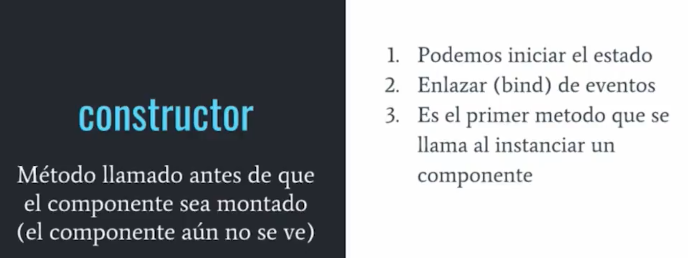
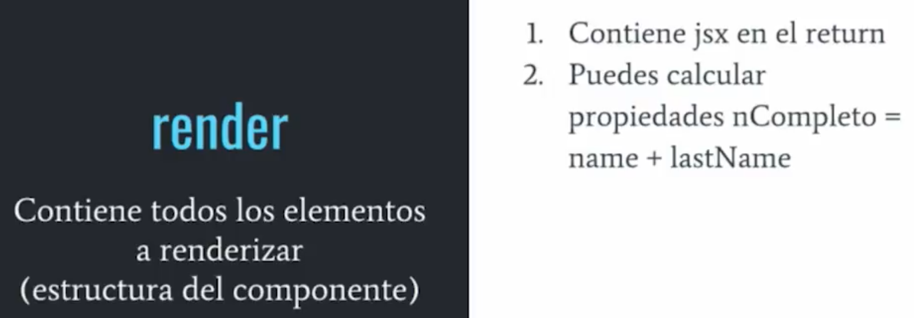

## Ciclo de Vida

### Montaje

### Actualización

### Desmontaje

### Manejo de Errores

## Componentes Puros

* Se crea heredando de PureComponent.
* Estos ya tienen el shouldComponentUpdate definido.

## División de componentes

La finalidad de dividirlos es por:

* Separación de responsabilidades
* Mejora la capacidad de reutilizar los componentes

**Smart Componet:** Statefull, Containers, Flat.

* Que hace
* Concentrado en el funcionamiento de la aplicación
* Conteninen componentes de UI u otros containers.
* No tienen estilos.
* Proveen de datos a componentes de UI u otros contenedores.
* Proveen de callbacks a la UI.
* Normalmente tienen estado.
* Llaman acciones.
* Generados por higher order components.

**Dumb Component:** Stateless, Pure, Presentational, Skinny.

* Como se ve.
* Puede contener smart components u otros componentes de UI.
* Permiten composición con {props.children}
* No dependen del resto de la aplicación.
* No especifica como los datos son cargados o mutados.
* Recibe datos y callbacks solo con propiedades.
* Rara vez tienen su propio estado.
* Están escritos como componentes funcionales a menos que necesiten mejoras de performance (PureComponent).